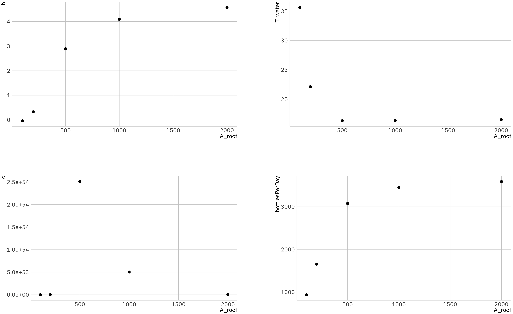
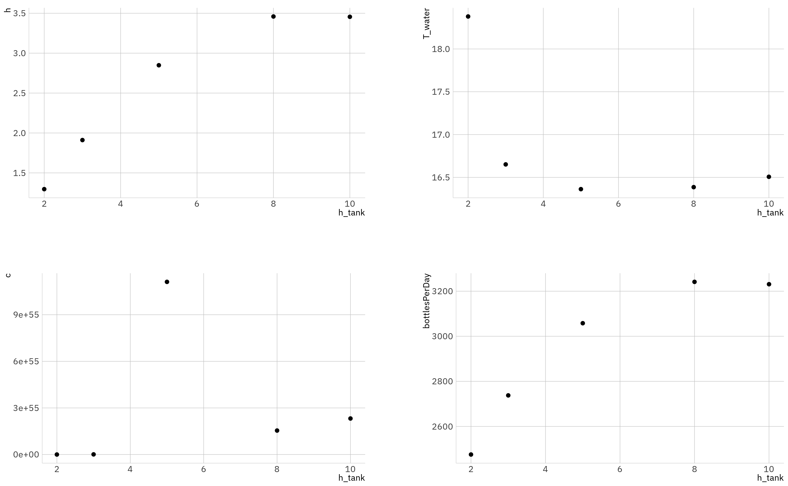
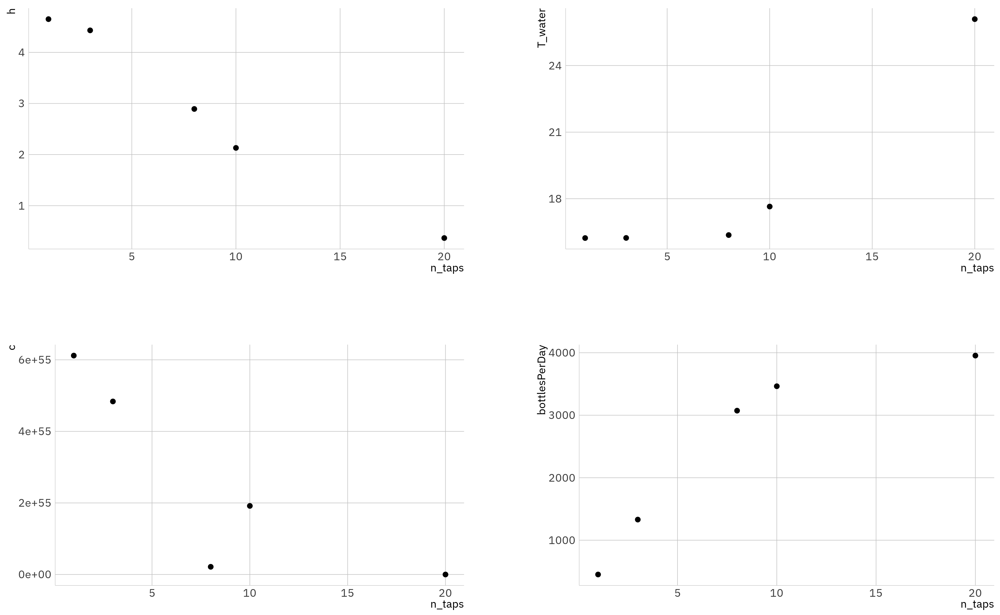
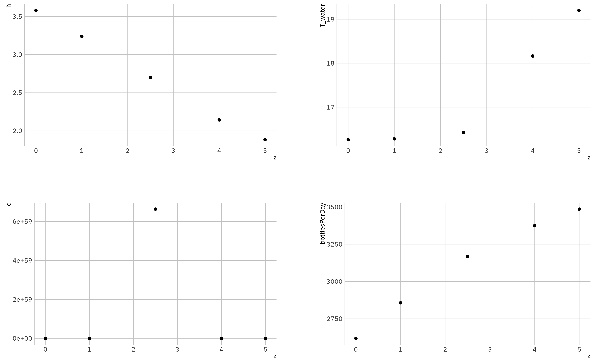

---
output:
  pdf_document:
    number_sections: true # true oder false, ob Überschriften nummeriert werden
    fig_height: 7
    fig_width: 7
    template: null
papersize: a4
md_extensions: pipe_tables, table_captions, header_attributes, task_list, implicit_figures, blank_before_blockquote, citations
link-citations: true
classoption: bibliography=totoc
geometry:
- margin=0.5in
header-includes:
 - \usepackage{commath} # für int ... dx (schönes d durch \dif), dx/dt (\od{x}{t})
 - \usepackage{float}
 - \floatplacement{figure}{H}
 - \usepackage{wrapfig}
 - \usepackage{pdfpages}
 - \usepackage{graphicx}
 - \usepackage[caption = false]{subfig}
 - \usepackage{mathtools}
 - \usepackage{grffile}

bibliography: ./references.bib
nocite: "@*"
csl: /Users/Robert/.pandoc/chicago-note.csl
lang: en-US # de oder en-US, wichtig für Inhaltsverzeichnis
title: numWater.Stochastic
subtitle: A numeric model for water supply systems including considerations about random precipitation
author: Robert Egel
date: "01.14.2020"
---

\begin{wrapfigure}{r}{0.4\textwidth}
  \vspace{-20pt}
  \begin{center}
    \includegraphics[width=0.38\textwidth]{./pictures/Dependencies_03.pdf}
  \end{center}
  \vspace{-15pt}
  \caption{System diagram with relations and transferred between processes \label{systemDiagram}}
  \vspace{-20pt}
\end{wrapfigure}

# Modeling of the Stochastic System
As a basis for a more realistic approach to modeling a water system for a rural school in Nyamasheke, Rwanda, a region with very irregular rain precipitation, the complex dynamic model created initally, was complemented with stochastic behavior.
Additionally, it was simplified intensively: the processes *microscopic water inflow/outflow* and *macroscopic water inflow/outflow* were combined to a single *water inflow/outflow (I/O)* process. Thereby the interaction between the processes is eased since now everything is calculated on the same time scale. The new system diagram is shown as Figure \ref{systemDiagram}.
Furthermore the time steps were increased from one second to five minutes, which makes it possible to evaluate the model behavior for longer time periods in a more consistent manner: all output variables are calculated for each point in simulation time.

<!--
- system diagram (functional/black box)?
- relate to Design Space diagram (relate inputs to design spaces) lecture 8
-->

## Definition of High Performance Criteria \label{sectionHPC}
The High Performance Criteria (HPC) introduced before were used for this task as well. In Table \ref{tableHPC}, these criteria can be observed.
Using deterministic calculations, each high performance criterion except *provide healthy water* could be satisfied. This is due to the fact that according to @blausteinEscherichiaColiSurvival2013, E.coli-bacterial growth is not temperature-dependent enough to be controlled entirely by the temperature in the water tank: no matter the temperature, according to the model, the bacteria will keep growing exponentially. Thereby the limit of bacterial concentration will be exceeded after a few days. Options to improve this situation could be filtering or exposure to UV light, which would eventually inactivate all E.coli bacteria.

| \sc objective                                                   | \sc {key indicator}                    | \sc {Unit (SI)}  | \sc{extent}    |
|:----------------------------------------------------------|:---------------------------------|:----------|:-----------|
| provide enough water for each individual within school time | $0.5 l$ Bottles filled on a school day | 1          | > 2000 |
| provide healthy water                                       | bacteria concentration $c$                   | $num/m^3$    | < $25 \cdot 10^{-4}$       |
| provide a pleasant drinking temperature                     | temperature                      | $^\circ C$ | max. 17°C     |
Table: High Performance Criteria \label{tableHPC}

## Selection of random variables and according distribution functions
For selecting random variables, an agile approach was chosen: start with a single variable and add more eventually, if there's a need.
Since all of the high performance criteria of this model depend heavily on water inflow and outflow, a variable influencing this process was chosen. Of course, design parameters like $A_{roof}$, $h_{tank}$ and $z$ are known, thus it does not make sense to make those stochastic.
Contrarily, a key environmental parameter to the I/O process is the amount of rain that forms the water inflow into the system. This parameter has been dynamic from the beginning: the mean annual rain curve was developed from regional climate data [@NyamashekeClimateAverage]. That fact is very important, because therefore seasonal changes are considered automatically, which has a significant effect on the model, for the fact that in Rwanda there are droughts in summer and rain periods in spring and fall.
From those monthly values, a spline was used to interpolate daily precipitation, which assumes that each day is rainy, as can be seen in the top left plot in Figure \ref{raincurve}.

Contradictory to this assumption, in reality there's not going to be rain on each day. Furthermore the precipitation on i.e. January 1st is never going to be the same every year, in other words: the daily precipitation is highly correlating with the daily mean, but it's not exactly the same. That's why the new daily rainfall is calculated based upon two stochastic functions: a binomial distribution, which is used to determine whether there is going to be rain on a specific day, as well as a Gumbel distribution, which is used to introduce random deviations from the mean rainfall. An evolution of the rain curve model is shown in Figure \ref{raincurve}.

Thereby, the binomial distribution plays a crucial role: as can be seen in the upper right plot of Figure \ref{raincurve}, for each day there is a certain probability to be rainy or not, while most days tend to be dry. The probability has been set to $20\%$, so statistically there aught to be rain in one of five days.
According to the fact that the climate data is cumulated for months and at the end of the month there should have fallen about as much rain, as the mean data predicted. This is conflicting with the this rain probability, consequently the daily precipitation is scaled accordingly to the rain probability, as can be inspected in the aforementioned plot.

The second distribution adds random scatter around the mean rain curve, as depicted in the lower right plot of Figure \ref{raincurve}. To find an appropriate distribution function, public literature was reviewed.
Many publications suggest a variety of functions like *Gaussian Normal*, *Log-Normal*, *Gamma*, *Weibull*, *Fisher* and *Gumbel* distributions [@arvindStatisticalAnalysis302017; @boudrissaModellingMaximumDaily2017; @dhvconsultantsbvHowAnalyseRainfall2002; @dirkFrequencyAnalysisRainfall; @koutsoyiannisStatisticsExtremesEstimation2004].
Of course a normal distribution is a good start and is used in many cases, e.g. @dirkFrequencyAnalysisRainfall, but @thayerwatkinsInappropriatenessApplyingNormal suggests this is not an optimal choice, since it does not handle extreme values very well.

Finally the Gumble distribution was chosen, because it is used throughout all reviewed references contrarily to the other extreme value distributions (Gamma, Weibull, Fisher, Log-Normal). Even Wikipedia suggests application of the Gumbel distribution for precipitation simulation: "In hydrology, therefore, the Gumbel distribution is used to analyze such variables as monthly and annual maximum values of daily rainfall and river discharge volumes, and also to describe droughts."[@GumbelDistribution2019].

\newpage

\begin{wrapfigure}{l}{0.6\textwidth}
  \vspace{-0pt}
  \begin{center}
    \includegraphics[width=0.58\textwidth]{./pictures/gumbelDens.png}
  \end{center}
  \vspace{-10pt}
  \caption{Probability density function of Gumble distribution with same parameters as used in model simulation \label{gumbleDens}}
  \vspace{-10pt}
\end{wrapfigure}

The Gumble distribution's parameters are very closely related to the ones of a normal distribution, which makes fitting very easy to understand. The $\mu$-parameter is related with the mean of a normal distribution and moves the curve on the x-axis, defining the mode/peak of the distribution. The $\beta$ or in some examples $\sigma$ parameter is related to the standard deviation and can be calculated from it ($\beta = sd/\pi * \sqrt 6$). The $\mu$ parameter was set to follow the rain curve spline defined from climate data, while the standard deviation was set to the mean daily rainfall times a user specified `sdFactor`. After a few experiments, this factor was set to $1/10$ for model simulations, causing significant scatter around the predefined curve, while this curve is still noticeable, as illustrated in the lower right plot of Figure \ref{raincurve}. A probability density curve of the Gumble distribution with the mentioned parameters is shown in Figure \ref{gumbleDens}. The scatter generated by this random function is added to the existing rain curve. 

Unfortunately, the Gumbel distribution is not implemented in `R`, therefore the `powdist` package dealing with Power Distributions[@anyosaPowdistPowerReversal2017] was included in the scripts.

<!-- Explain why gumble distribution was chosen, reference to papers.
Explain development:
Deterministic → binomial → binomial + gumble.
Show histograms, density and exemplary time-rain curve -->
## Determination of time scale
<!-- Explain unification of model time scales
Explain why rain changes on a daily basis -->
Since the time scales of the whole model was unified as explained in the beginning of this report, a lot of the problems mentioned in the presentation could be solved. It also helped with the definition of the time scale for the random variable.
The randomized rain curve is defined to return a vector with daily precipitation. Thereby the variable is dynamic throughout the time steps. Nonetheless, if there is going to be any rain at all on a certain day, the amount of rain is assumed to be constant throughout all time steps of this day. So the chosen time scale is actually something in between the options in the tutorial *Case I* and *Case II*: it is dynamic, but stays constant for certain periods of time, i.e. days.

The simulation time period was set to 365 days, so one year, which is the minimum time period to consider when paying attention to water inflow and outflow because the rain curve is modelled from historical monthly mean rainfall values. This makes need for an optimization of the program so that model execution becomes more efficient and thereby quicker.

## Parallel Computing \label{parallelComp}
To speed up computing time, a way to parallelize the `R` code was found: by using the packages `doSNOW`[@ooiDoSNOWForeachParallel2019] (based on `snow`[@tierneySnowSimpleNetwork2018]) and `foreach`[@ooiForeachProvidesForeach2019], the behavior of `replicate()` was replicated (no pun intended ;)). This method allows to use all processor cores in parallel, which speeds up running the model significantly.
This makes even more sense when running the models on a cloud hosted virtual machine, which can offer an arbitrary amount of highly performant CPUs.

# Analysis of the models behavior
## Behavior with standard parameters
<!--
- play around with n_mc?
  - confidence intervals
  - mean
  - computing time
- explain behavior over time
- compare with deterministic approach
-->

After including the randomized rain and rewriting the code accordingly to section \ref{parallelComp} the distribution plots were generated as suggested in the task description. But as the system is highly benefiting from visualizations of the output behavior over time, it was considered that it would make sense to create such plots and analyze those for this type of system in addition to the existing density plots and histograms. 

In Figure \ref{MC.over.time} it gets clear, what is meant by that: the upper left plot of the Figure shows the development of water height inside the tank with a few different metrics. The first thing to consider is the black line, which shows the mean curve of all Monte Carlo runs. As a reference, the deterministic curve is displayed in blue as well.
Quite interesting is that, as suggested by @read6, there can be a significant difference between mean estimate curve and deterministic curve, although the random distributions mean is based on the deterministic values. Albeit an important influence probably lies in the choice of distribution functions and their interaction. 

Therefore it is always appropriate to consider making a model stochastic, because it can deliver more differentiated information about a system than a deterministic one, assuming the distribution functions were chosen representatively.
Even more information is delivered by the third category of line in this type of plots: the 95% confidence intervals.
Based on the assumption that the data provided by the simulation is representative, you can statistically estimate an interval, in which a new value will lie with a confidence of 95%.

In other words: based on this plot it can be inferred that the water tank will not run empty in the simulation period for a confidence of 95% (or actually 97.5%, since the 95% CI consists of an upper and lower quantile), since it never touches the red line, which shows the High Performance Criterion. The same goes for the number of bottles per day, which never exceeds it's HPC. 

Contrarily, while the mean and deterministic water temperature always stay well below the 17°C limit, the 95% confidence interval widens and the upper boundary crosses the line in spring and fall. That is due to the greater amount of rainfall in that seasons, which takes the ambient air temperature and mixes with the cooler water that has been staying in the tank. Anyhow in the summer, where the water temperature in the drought season is most important, because it exhausts the people, the HPC is fulfilled. Even when it is not fulfilled, the largest values are still below 17.5°C for 95% confidence, which seems acceptable to me.
A problem that occurs in large numbers of Monte Carlo runs, is that outliers regarding the temperature are generated in the rare cases if the tank runs empty. That shows a general issue of the mean as a metric, since it is quickly influenceable by such outliers, as can be seen around day 220.
As mentioned in section \ref{sectionHPC}, the bacteria concentration will always exceed it's HPC according to the implemented model, which is why it is no longer analyzed here.

\begin{figure}
  \label{hOverTime16} \includegraphics[width=\textwidth]{plots/allModelsVersion3.2.365days.n_mc=2048.over.time.hpc.png}
  \vspace{-30pt}
  \caption{Model behavior dynamically over time, 2048 Monte Carlo runs}
  \label{MC.over.time}
  \vspace{-10pt}
\end{figure}

In Figure \ref{hOverTime} it can be observed how the number of Monte Carlo runs affects the results: with a higher number of runs ... (i.) ... the lines of mean and confidence intervals get smoother, which shows the effect of the law of large numbers: the metrics gain predictive power and significance. (ii.) ... the confidence intervals widen, because the data generated by more runs are more representative and cover a larger portion of the result space. (iii.) ... the confidence intervals get more accurate. While with 128 runs, it looks like the tank may run empty, the lower confidence interval boundaries of the more significant diagrams with more runs don't show that behavior. This shows that the data generated by 128 runs is not representative (iv.) ...there is not a noticeable difference between 512, 1024 and 2048 runs, except the lines getting smoother. Therefore it can be assumed that even 512 runs generate a representative dataset.

\begin{figure}
    \centering
    \subfloat[16 Monte Carlo Runs]{\label{hOverTime16} \includegraphics[width=0.32\textwidth]{plots/allModelsVersion3.2.365days.n_mc16.h.over.time.png}}
    ~
    \subfloat[128 Monte Carlo Runs]{\label{hOverTime128} \includegraphics[width=0.32\textwidth]{plots/allModelsVersion3.2.365days.n_mc128.h.over.time.png}}
    ~
    \subfloat[512 Monte Carlo Runs]{\label{hOverTime512} \includegraphics[width=0.32\textwidth]{plots/allModelsVersion3.2.365days.n_mc512.h.over.time.png}}
    \\
    \subfloat[1024 Monte Carlo Runs]{\label{hOverTime1024} \includegraphics[width=0.32\textwidth]{plots/allModelsVersion3.2.365days.n_mc1024.h.over.time.png}}
    ~
    \subfloat[2048 Monte Carlo Runs]{\label{hOverTime2048} \includegraphics[width=0.32\textwidth]{plots/allModelsVersion3.2.365days.n_mc2048.h.over.time.png}}

    \caption{Water height curves over time, different amounts of Monte Carlo runs compared} \label{hOverTime}
\end{figure}

\begin{figure}
  \includegraphics[width=\textwidth]{plots/allModelsVersion3.2.365days.n_mc=2048MC.dist.png}
  \caption{Distributions of the output variables, 2048 Monte Carlo runs}
  \label{distMC}
  \label{whatever}
\end{figure}

Finally, Figure \ref{distMC} shows the density curves and histograms as suggested by the tutorial. The results of `MC_Process()` are not analyzed here, because the same information can be taken out of the aforementioned plots. 

Those plots give a broad overview on the model behavior, but because of the neglection of time, a lot of the characteristics mentioned above cannot be seen. The histogram show a quiet clear corelation with the density plots. There are no gaps between histogram bars, as they occur in plots for low Monte Carlo runs. The form of the density curves for water height and bottles per day show similarities to Minimum Extreme distributions as they were mentioned in the 6th lecture. The Minimum Extreme shows similar behavior to Gumble distributions, just mirrored around the peak value. The density function of the bacterial concentration goes in a different direction and appears to be related to a Gamma or Gumble distribution with a long tail and short head. Unfortunately, the histogram and density curve of the water temperature does not give much space for interpretation. Due to the mentioned outliers, the histogram is very wide and only a single bar is recognizable. An idea for further work might be the removal of outliers which might be helpful to deal with this problem. 

## Local sensitivity analysis
<!--
- relate sensitivity analysis to optimization techniques (OFAT = local sensitivity analysis, Full Factorial optimization = global) lecture 8
-->
The local sensitivity analysis, which was calculated consistently with 128 Monte Carlo runs per variation, follows the one factor at a time (OFAT) strategy as mentioned in the 8th lecture. Strengths of this approach is, relatively to a full factorial optimization, the low number of needed variations, but that's on the cost of seeing input parameter interactions and non-linear behavior. Albeit it gives a very intuitive of interactions between one input and the output parameters at once. 

Figure \ref{sensA_roof} shows quite characteristic model behavior. When increasing the roof area from which rain is collected, the water height increases as well, but not in a linear manner as one might suspect, but in a logarithmic one: because the water height is restricted by h_tank, the growth slows down, as the roof area increases. The water height approaches a limit. Because the number of bottles per day is closely related to the water height (higher water pressure, therefore the flow velocity increases) it shows similar behavior, but its logarithmic character is even more distinctive, because of it's relation to the water height using Bernoulli's Law. Very interesting is, that for the first two variations, the mean water height is very low, probably because the tank runs empty very often because of the low inflow. Because of that, the mean number of bottles per day is also very low and High Performance Criteria will not be fulfilled for these variations.

Interpreting the bacteria concentration is a little harder: the first two variations show a very low bacteria concentration, due to the fact that bacteria accumulation on the tank walls is neglected, so the tank is resetting itself to a clean state if it runs empty. The peak shows the normal behavior, which is quite high as can be inspected in Figure \ref{distMC}. The concentration declines with bigger roof area, because a huge amount of fresh water with a relatively low concentration is mixed in. The water temperature shows similar behavior: as long as the tank does not run empty, the results are very predictable, but the first two points show that the model has difficulties with the tank running empty.

After all this might be a great option to optimize the system in terms of inflow and outflow. 

\newpage

The variation of the whole tank height in Figure \ref{sensH_tank} show's similar behavior to variations of the roof area: the water height and bottles per day variables approach a limit and show a logarithmic form. The temperatures first point shows another quite irritating reaction, which can be explained by the tank running empty because the volume of it is very low and it would not last throughout the summer. Interesting is the behavior with great heights: the mean temperature increases, that's because the underground height of the tank is set to 2.5 meters. Therefore, 10 meter high tank stick out the soil for 7.5 meters and the air temperature is higher than the soil temperature. Unfortunately I cannot fully explain the behavior of the bacteria concentration. The first two points show a low concentration because the tank is likely to run empty during summer and the bacteria acts as explained for the variation of the roof area. 

\newpage

In Figure \ref{sensN_taps} the reactions to variations of the number of outflow taps is shown. Logically, if there are more taps, the outflow increases and thereby the number of bottles that can be filled. But of course, the water height declines with that development. Because of this, the mean number of bottles per day shows a logarithmic form again, indicating a limit. That's due to the lower water pressure with lower water height. 
Again, only the reaction to an empty-running tank can be interpreted fairly for the water temperature and bacteria concentration. 

Perspectively a big increase in the number of bottles per day can be seen, it's peak is higher than in all other variations. Thereby, just like the roof area, this might be a good input variable to maximize that number while still keeping in mind other high performance criteria. Perspectively a number between 10 and 20 taps might be interesting, a good start might be 15.

\newpage

Figure \ref{sensZ} depicts the sensitivity analysis for the height difference between the bottom of the tank and the taps. This could be realized by placing the tank on a hill, which would make sense since Nyamasheke is a mountainy region after all. Because of the increased water pressure induced by increased $z$, the effect is practically the same as increasing the number of water taps. The results show the same behavior as above. 

\newpage

## Global sensitivity analysis
\begin{figure}  
  \centering
  \makebox[\textwidth]{\includegraphics[width=\paperwidth]{plots/allModelsVersion3.2.LHS.365days.n_lhs=128corChart.png}}
  \caption{Overview chart with correlations, scatterplots and histograms for all variables in the global sensitivity analyis}
  \label{globSens}
\end{figure}

Finally in the global sensitivity analysis, the Latin Hypercube Sampling algorithm was used to introduce a analysis close to a Full Factorial Optimization (FFO), only without the use of the Monte Carlo method. Per se this is not a requirement of the FFO, but it would make sense since the model is stochastic and has a high variability between runs, as can be seen in the histograms and density plots in Figure \ref{distMC}. 

The `lhs()` function included in the `tgp()` library [@taddyTgpBayesianTreed2016] takes a matrix filled with boundaries of variables and automatically creates a Beta distribution on this basis, as can be seen in the histograms of Figure \ref{globSens}. On this system of distributions, the Latin Hypercube Sampling method is applied, which aims to eliminate corelations between input variables, having data points all over the distributions of the input variables and keeping the total amount of data points low. This makes the method perfect for complex simulation systems, since these tend to take a lot of computation time. 

For easier interpretation, the `pairs()`-plot was replaced by a corelation overview chart, provided by the package `PerformanceAnalytics` in Figure \ref{globSens}. 
To keep this text compact, only the I/O relevant output variables are considered. 

What catches the eye first is the high corelation between the number of bottles per day and the total number of bottles. This makes total sense since they are very tightly related to each other, therefore only the number of bottles per day is considered from now on, especially because it defines one of the High Performance Criteria. 
From top to bottom, the first input variable to look into is the roof area. There's a relatively high positive corelation with high significance to both the water height and the number of bottles per day, just as expected from the local sensitivity analysis.
Next up is the height of the water tank. This variable is not highly corelating to the important output variables, possibly due to interaction with other inputs. Nonetheless, it was not one of the most effective inputs in the local sensitivity analysis as well.
The number of outflow taps has a strong negative corelation with water height and even stronger positive corelation with bottles per day, both have high significance. This makes sense since in the local sensitivity analysis it was said that this would be a great parameter for optimization, just as the roof area.
Interestingly, the height difference $z$ does not have high corelation with either of the output variables. This does not make much sense considering the local sensitivity analysis. There might be an issue with interacting input parameters as well, after all there is a low significance for these corelations.
Last but not least, an interesting corelation is the height above the ground with the water temperature. This makes total sense considering the results of the deterministic modelp and the development of water temperature in the local sensitivity analysis for the tank height.

\newpage

# List of References

